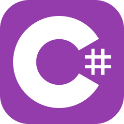

<!-- 
-->
  <!-- -->
<!--
-->

______ ฅ^>⩊<^ ฅ ______

___

    <!-- Trocar por imagem no topo -->
   

___

<h3>About 一</h3>

  <b>name:</b> Guilherme Andrade Camikado 
  <b>alias:</b> <i>The_Camikado</i> 
   
  <b>spawn date:</b> 24/01/2002 
  <b>spawn location:</b> Brazil - São Carlos, SP 
  <b>timezone:</b> UTC-3

<h3>About 二</h3>
So like... I began playing videogames, got addicted to solving issues some I created mostly I did not, ended up wanting to create something to this electron-rearranging machine started by learning how to make videogames learned blender, C# and english by playing VrChat and destiny put me into doing websites entered an university, later a technical school and ended up finding a job where i was tasked doing almost everything.

Now I think I'ma Sys. Developer Mainly a web one.

#### Links:
- [My Website](https://guicamikado.github.io/MyWebsite/?page=skills)
- [LinkedIn](https://www.linkedin.com/in/guiacamikado/)
- [E-mail](guilherme.camikado@gmail.com)

<h3>Skills</h3>

  
  
   
  
  
  
  
   
  
  
  
  
   
  
  
  
  
   
  
  
  
  
     
  
  
  
  

 

<!--
-->
  <!-- -->
<!--
-->
